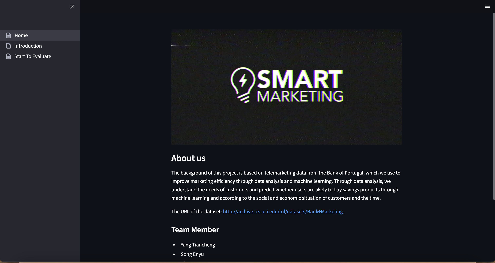

## SECTION 1 : PROJECT TITLE
## IRS-PM-Group17-SmartMarketing

---

## SECTION 2 : EXECUTIVE SUMMARY / PAPER ABSTRACT

This report starts with the fact that in today's artificial intelligence era, business intelligence and smart marketing offer businesses or organizations the opportunity to improve the efficiency and effectiveness of their marketing. As one of the main marketing methods of banks, direct telemarketing is one of the main ways banks invest a lot of human cost and resources to market their regular products every year.

SMARTMARKETING helps companies using this product to achieve cost savings by using knowledge models to predict whether a specific user will accept the marketing or not.

---

## SECTION 3 : CREDITS / PROJECT CONTRIBUTION

| Official Full Name  | Student ID (MTech Applicable)  | Work Items (Who Did What) | Email (Optional) |
| :------------ |:---------------:| :-----| :-----|
| Yang Tiancheng | A0261626E | xxxxxxxxxx yyyyyyyyyy zzzzzzzzzz| E0983020@u.nus.edu |
| Song Enyu | A0261704L | Use streamlit design system| E0983098@u.nus.edu |
| Tian Qingyun | A0261777R | Improve model accuracy| E0983171@u.nus.edu |
| Zhang Junmengyang | A0261791Y | Background Research | e0983185@u.nus.edu |

---

## SECTION 4 : VIDEO OF SYSTEM MODELLING & USE CASE DEMO

---

## SECTION 5 : USER GUIDE

`Refer to appendix <Installation & User Guide> in project report at Github Folder: ProjectReport`

### [ 1 ] change direction into IRS-PM-Group17-SmartMarketing folder:

> (project) $ cd IRS-PM-Group17-SmartMarketing

### [ 2 ] Install relying library

### Install additional necessary libraries. This application works in python 3.8.
> (project) $ pip install -r requirement.txt

### [ 3 ] To run the system in other/local machine:

> (project) $ streamlit run Home.py
**Go to URL using web browser** http://localhost:8501

---
## SECTION 6 : PROJECT REPORT / PAPER

`Refer to project report at Github Folder: ProjectReport`

---
## SECTION 7 : MISCELLANEOUS

`Refer to Github Folder: Miscellaneous`

### bank-additional.csv
### bank-additional-full.csv
### bank-additional-names.txt

---

**This [Machine Reasoning (MR)](https://www.iss.nus.edu.sg/executive-education/course/detail/machine-reasoning "Machine Reasoning") course is part of the Analytics and Intelligent Systems and Graduate Certificate in [Intelligent Reasoning Systems (IRS)](https://www.iss.nus.edu.sg/stackable-certificate-programmes/intelligent-systems "Intelligent Reasoning Systems") series offered by [NUS-ISS](https://www.iss.nus.edu.sg "Institute of Systems Science, National University of Singapore").**

**Lecturer: [GU Zhan (Sam)](https://www.iss.nus.edu.sg/about-us/staff/detail/201/GU%20Zhan "GU Zhan (Sam)")**

**zhan.gu@nus.edu.sg**
